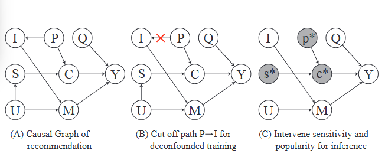

<h1 align="center"> <p>CausalEPP</p></h1>
<h3 align="center">
    <p>"Taming Recommendation Bias with Causal Intervention on Evolving Personal Popularity"</p>
</h3>


## Introduction

Existing debiasing methods mitigate popularity bias often uniformly across all users and only partially consider the time evolution of users or items. However, users have different levels of preference for item popularity, and this preference is evolving over time. 

To address these issues, we propose a novel method called *CausalEPP* (Causal Intervention on Evolving Personal Popularity) for taming recommendation bias, which accounts for the evolving personal popularity of users.
Specifically, we first introduce a metric called “popularity sensitivity” to quantify each user’s preference for popular items. Then, we design a causal graph that integrates popularity sensitivity into the conformity effect, and apply deconfounded training to mitigate the popularity bias of the causal graph. During inference, we consider the evolution consistency between users and items to achieve a better recommendation.


<!-- ## Causal Graph

<!--  -->

Causal Graph with the consistency of popularity sensitivity and item popularity:
- (A): Causal graph to describe the recommendation process that incorporates popularity sensitivity “S” into the conformity effect and disentangles quality “Q” from popularity “P”.
- (B): During training, we cut off the influence from local popularity to items for deconfounded training.
- (C): During inference, we intervene popularity sensitivity “𝑠∗” and local popularity “𝑝∗” for bias adjustment.

## Algorithm:
The algorithm illustrates the detailed steps of CausalEPP:


<!--  -->


## Code Usage

### Dataset Preparation
We builds our code upon the code TIDE, and use the datasets as follows. 
We used [Amazon-Music](https://jmcauley.ucsd.edu/data/amazon/), [Douban-movies](https://github.com/DeepGraphLearning/RecommenderSystems/blob/master/socialRec/README.md#douban-data), and Ciao. You can download the dataset into "/data" and rename the rating file as "ratings.csv". The code will process the data automatically when you run main.py

Note that file /lgcn_graph/Douban-movie/lgcn_graph_index.zip needs to be unzipped

The data statistics:


### Preprocessing
Use the jupyter notebook `Preprocessing.ipynb` to process the datasets for creating five files:
- all_times.npy for record time steps
- item_frequency.csv for record item frequency
- item_frequency_all_times.csv for record short-term popularity
- user_frequency_all_times.csv for record short-term user click frequency
- user_frequency_high_popularity_all_times.csv for record the frequency how user clicks on high-popularity items
Both `user_frequency_high_popularity_all_times.csv` and `user_frequency_all_times.csv` are used to calculate the popularity sensitivity.

### Run script

```
python main.py
```

All parameters and choices can be found in `config.py`:
Set `self.method = 'CausalEPP'` to run the CausalEPP code, and `self.method = 'TIDE'` for TIDE model.

After training, the well-trained model will in the directory `./model/Ciao/xx`, you can further intervene it to get the results. The parameters for intervention is in `config.py`: 
- `dt_i` and `dt_u` indicate the evolution forecasting step for item popularity and popularity sensitivity, respectively. 
- `rolling_window` indicates the rolling windows for moving average of both item popularity and popularity sensitivity. 
